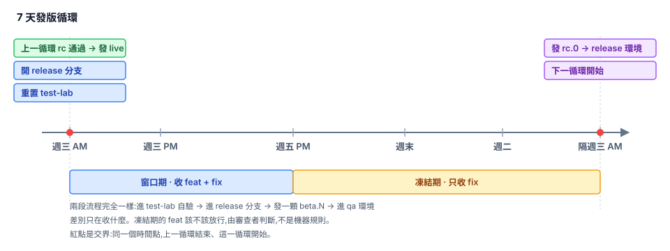
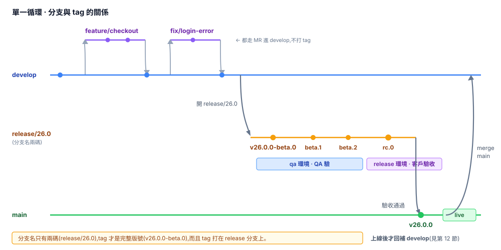

# 發版流程規範

> 網站專案 · GitLab CI · 打包上傳私有雲 · 版號由 release-it 管理

> **關於本文的依據**
>
> 第 11–15 節與第 4、5、6、7、8 節的警語,來自一次完整的實測演練(release-it 20.2.1、Node 22,
> 跑過 1.0.0 → 1.7.0 共 8 輪發版,含雙分支並行、hotfix 交錯、版號倒退、整版放棄等情境)。
> 這些段落標示的行為都是實際跑出來的結果,不是推測——照著做之前不需要再自己驗一次。
>
> **例外是環境路由的部分**(第 1 節、第 7 節的 hotfix 環境選擇、第 9 節 CI):
> 演練環境沒有接 pipeline,那些結論是依第 9 節的 CI 規則推論的。第一次照做時請在自己的 pipeline 上確認。

---

## 1. 環境對照

| 環境 | 誰在用 | 觸發方式 | 版號範例 |
|---|---|---|---|
| **lab** | 自己隨便測 | merge 進 `test-lab` | —(不打 tag,沒有版號) |
| **qa** | QA 品管 | tag `v1.0.0-beta.N` | `1.0.0-beta.3` |
| **release** | 客戶驗收 | tag `v1.0.0-rc.N` | `1.0.0-rc.0` |
| **live** | 客戶正式用 | tag `v1.0.0`(手動確認) | `1.0.0` |

**lab 是免洗的,不打 tag。** merge 進 `test-lab` 就部署。只有 qa 以上才留 tag,因為那些是別人驗過、需要追溯的版本。

### ⚠️ 每個環境同時只能有一條 release 分支佔用

**qa 和 release 各只有一套環境,沒有第二份。** 兩條 release 分支同時發同一種預發版,後發的會直接把前一個蓋掉——正在測的人版本會突然倒退、功能變少,而且不會收到任何通知。

所以並行時**唯一合法的組合**是:

```
release/26.0 → rc     → 佔 release 環境(客戶驗收)
release/26.1 → beta   → 佔 qa 環境(QA)
```

- ✗ **兩條都在 rc** —— 搶 release 環境
- ✗ **兩條都在 beta** —— 搶 qa 環境
- ✓ 一條 rc + 一條 beta —— 各佔一個,互不干擾

這條約束推導出後面好幾條規則:為什麼進 rc 後才開下一條分支(第 6 節)、為什麼並行時前一條不能退回 beta(第 4 節)、為什麼 hotfix 要走 beta 通道不走 rc(第 7 節)。**它們都是同一件事:環境是單一 slot。**

---

## 2. 分支

| 分支 | 從哪開 | 合併回哪 | 生命週期 |
|---|---|---|---|
| `main` | — | — (終點) | 永久,等於 live 現況 |
| `develop` | — | — (只被 merge,不 merge 出去) | 永久,下一版整合區 |
| `test-lab` | — | **不合併出去**(單向沙盒) | 永久,但可隨時重置 |
| `feature/*` | `develop` | `develop` | merge 後砍 |
| `fix/*` | `develop` | `develop` | merge 後砍 |
| `fix/26.0/*` | `release/26.0`(**進 rc 後才用**) | 同一條 `release/26.0` | merge 後砍 |
| `release/1.0` | `develop` | `main` → 再由 `main` → `develop` | 上線觀察期過後砍 |
| `hotfix/1.0.1` | `main` | `main` → 再由 `main` → `develop` → 進行中的 `release/*` | 上線後砍 |

> **注意 `release/*` 和 `hotfix/*` 都是先進 `main`,再由 `main` 往下流到 `develop`**,不要從 release 分支直接 merge 進 develop。理由見第 12 節。
>
> 所有分支進 release 分支之前,都要先 merge 進 `test-lab` 自己驗一輪。

### fix 要從哪開

**一律從 `develop` 開——除非那條 release 分支已經進 rc。**

| 那條 release 分支的狀態 | fix 從哪開 | 分支名 |
|---|---|---|
| 還在 beta(或還沒開 release 分支) | `develop` | `fix/SG-3656` |
| **已經進 rc** | 該 release 分支 | `fix/26.0/SG-3702` |

判斷只需要看那條分支自己的狀態,不用去查別人開了什麼分支。

**為什麼進 rc 後要換起點?** 因為「進 rc」和「開下一條 release 分支」是同一個時間點發生的(見第 6 節)。從那一刻起 `develop` 裝的是下一版的東西,再從 develop 開 fix 併進來就會**夾帶下一版的功能**。

實測:`release/1.7` 開分支後 develop 累積了 19 顆 commit,從 develop 開 fix 併進 `release/1.7`,那 19 顆全部跟著進去——git 不會警告,測試也不會失敗,因為那些功能本身沒問題,只是不該出現在這一版。

**為什麼 beta 階段可以從 develop 開?** 那時 develop 裝的就是這一版的內容(照團隊紀律,要發才 MR 進 develop),夾帶進來的都是本來就要發的,無害。

> **同步前掃一眼要帶什麼進去**,30 秒的事:
>
> ```bash
> git log release/26.0..develop --oneline
> ```
>
> 每一行都會進這一版。這把「靜默夾帶」變成看得見的清單。也可以做成 MR 檢查,自動列出來要人確認。

### fix 什麼時候回到 develop

- **從 `develop` 開的**:併回 `develop`,再由 develop 同步進 release 分支。develop 立刻拿到修正。
- **從 release 分支開的(`fix/26.0/*`)**:併回同一條 release 分支就好,**不要併回 develop**。

第二種不併回 develop 的理由:那條 fix 分支的**祖先包含整條 release 分支**,merge 進 develop 會把 release commit、版號、CHANGELOG 全部帶過去。修正會在 `26.0.0` 上線時隨 `main` 一起流回 develop,一顆都不會少。

> ⚠️ **例外:如果 `26.0` 整版放棄**,`fix/26.0/*` 的修正會跟著消失(從沒進過 develop)。要撿回來得用 `cherry-pick` 而不是 `merge`:
>
> ```bash
> git switch develop
> git cherry-pick <fix 的 commit>
> ```
>
> 用 merge 會把整條 release 分支的歷史一起帶進來。

**beta 階段和 rc 階段的 fix,發出來的是 `beta.N+1` 還是 `rc.N+1` 由 release 分支當下的階段決定**,不需要另外取名(不需要 `rcfix/*` 之類)。

分支名用**兩碼**(`release/1.0` 不是 `release/1.0.0`),因為同一條分支內版號的第三碼會變動:發完 `1.0.0-beta.0`、進到 `1.0.0-rc.0` 之後,若客戶回報的問題大到要 QA 重驗,就得升 patch 切回 beta 變成 `1.0.1-beta.0`(rc 不能倒退回 beta,見第 4 節)。用三碼命名的話分支名馬上就對不上了。

### `test-lab` 是單向的沙盒

任何東西都可以 merge **進去**測,但 `test-lab` **永遠不 merge 出來**。

```
feature/*  ──┐
release/1.0 ─┼─→ test-lab ─→ lab 環境
hotfix/*   ──┘                    ✗ 不回流到任何分支
```

因為 `test-lab` 上可能混著還沒驗過、甚至最後不會出的東西。merge 出去就把實驗性的 commit 帶進正式流程了。

**用法**

```bash
git switch test-lab
git merge --no-ff feature/export-filter      # 想測什麼就 merge 什麼
git push                                     # → 自動部 lab
```

衝突隨便解,反正這條分支的歷史不重要。

**定期重置**

歷史髒了、或跟 develop 差太遠,直接砍掉重來:

```bash
git switch test-lab
git reset --hard origin/develop
git push --force
```

建議每個循環開始時(週三開 release 分支那天)重置一次,保持乾淨。

> ⚠️ `test-lab` 要設成**允許 force push**,但**不要**設成任何 MR 的預設 target branch。有人手滑把 `test-lab` merge 進 develop 會很難清。

---

## 3. 時間週期(7 天循環)



週三早上是交界點(圖上的紅點),同一個時間點上一循環結束、這一循環開始:**上一循環的 rc 驗收通過發 live**、**這一循環開新 release 分支並重置 test-lab**。

| 期間 | 收什麼 |
|---|---|
| 週三下午 ~ 週五下班 | `feat` + `fix` |
| 週五下班 ~ 隔週三早上 | 只收 `fix` |

**由審查者判斷要不要擋。** 窗口是給人判斷用的基準,不是機器規則——凍結期的 `feat` MR 該不該放行,審查者看情況決定。

**兩個階段收的東西不同,但流程完全一樣**:merge 進 `test-lab` 自己驗 → merge 進 release 分支 → 發一顆 `beta.N` → 進 qa。不因為是新功能就重開分支或重置測試基準。

`test-lab` 在前面多一道關卡的好處是:**功能可以在進 release 分支之前先驗一輪**。驗壞了就不 merge,release 分支不會被污染。

---

## 4. 版號規則

```
1.0.0-beta.0  →  beta.1  →  beta.2  →  ...  →  rc.0  →  1.0.0
└──────────── qa 環境 ────────────┘        └─ release ─┘   live
```

- **identifier 只切一次**(`beta` → `rc`),單向不回頭
- beta 階段 QA 要重驗?`beta.N+1`,數字加就好
- rc 階段有小 bug?`rc.N+1`,客戶繼續測,QA 不介入
- **patch 位有兩個用途**:rc 修正要 QA 重驗(`1.0.1-beta.0`)、live 之後的 hotfix(`1.0.1`)
- 下一個循環是 minor(`1.0.0` → `1.1.0`)

> ⚠️ **rc 階段不回頭。** semver 的 pre-release identifier 是字母序比大小,`beta < rc`,同一個 patch 內發完 `rc.0` 就不能再回去發 `beta.N`。
>
> - **rc 有小 bug** → 發 `rc.N+1` 給客戶,**QA 不介入**
> - **修正大到需要 QA 重驗** → 在**同一條 `release/1.0`** 上升 patch 切回 beta:
>
>   ```bash
>   npx release-it --increment=prepatch --preReleaseId=beta --ci   # 1.0.0-rc.2 → 1.0.1-beta.0
>   ```
>
>   patch 升上去了,版號沒有倒退。重走 qa → rc,`1.0.0` 就此作廢不上 live。
>
> 這就是分支名用兩碼的原因:`release/1.0` 裡面跑到 `1.0.3` 都還合理。

> ⚠️ **雙分支並行時,前一條分支不能退回 beta——即使版號合法。**
>
> 正常並行時兩條線各自佔一個環境,互不干擾:
>
> ```
> release/1.0 發 v1.0.0-rc.1    → release 環境(客戶)
> release/1.1 發 v1.1.0-beta.2  → qa 環境(QA)
> ```
>
> 但 `release/1.0` 一旦退回 beta 發 `v1.0.1-beta.0`,它也會命中 qa 的規則 `/-beta\.\d+$/`,**跟 `release/1.1` 搶同一個環境**。而且 qa 環境的版號會從 `1.1.0-beta.2` 倒退到 `1.0.1-beta.0`(semver 上確實較小),QA 會看到版本變小、功能變少。
>
> 所以並行期間 `release/1.0` 只能一路 `rc.N+1` 走到上線。**要退回 beta 重驗,只有在單一 release 分支時才做得到。**

> ⚠️ **不能用 `npm run release:beta -- patch`。** 實測起點是 `1.0.0-rc.2` 時它算出 `1.0.0-beta.0`——版號倒退而且撞到已存在的 tag,發版直接失敗。
>
> 原因是 `--preRelease=<id>` 在**起點已經是 prerelease 時會蓋掉 increment 參數**,只遞增序號。semver 對 prerelease 做 `patch` 也只是「落定」不會進位:
>
> ```
> semver.inc('1.0.0-rc.2', 'patch',    'beta') = 1.0.0        ← 不進位
> semver.inc('1.0.0-rc.2', 'prepatch', 'beta') = 1.0.1-beta.0
> ```
>
> 詳見第 11 節。

---

## 5. Git 線圖 · 單一循環



**回補**:release 分支存活期間**不回補 develop**,只有正式版上線後才一次補完。理由見第 12 節。

> 實測:中途不回補**不會**造成衝突累積。`develop` 停在舊版號時 merge 進 release 分支,`package.json` 全程零衝突——因為 develop 側從沒動過 `version` 那一行,git 三方合併直接採用 release 側的值。

---

## 6. Git 線圖 · 兩條 release 分支重疊

進入 rc 之後就開新分支收新功能,舊分支保持乾淨到上線。

```
            開 release/1.0   開 release/1.1
                  │                │
develop ──●───────┴────────────────┴──────────────●───────────────●──
                                                  ▲               ▲
                                            merge main      merge main
                                            (1.0 上線後)    (1.1 上線後)
                                                  │               │
release/1.0  ─────●────●────●─────────●───────────┘               │
                beta  rc.0 fix      v1.0.0                        │
                            │      ← rc 階段只修 bug              │
                            └── 直接傳給 1.1,不經過 develop       │
                                     ↓                            │
release/1.1  ────────────────────────●───●───●────●───────────────┘
                                   beta.0    rc.0  v1.1.0
                                  ← 同時在收 feat

main ────────────────────────────────────●────────────●──
                                      v1.0.0        v1.1.0
```

**兩條 release 分支存活期間都不回補 `develop`**,所以 `develop` 一直停在上一個正式版,直到 `1.0.0` 上線才第一次前進。這也是為什麼 `release/1.1` 的第一顆 beta 要寫死版號(見下)。

### rc 階段的修正怎麼走

進 rc 之後,`release/1.0` 的修正**只在自己這條線上循環**,不碰任何其他分支:

```bash
git switch -c fix/xxx release/1.0        # 從 release/1.0 開(或直接在上面 commit)
git commit -m "fix: ..."

git switch test-lab && git merge --no-ff fix/xxx && git push    # lab 驗

git switch release/1.0 && git merge --no-ff fix/xxx
npm run release:rc                                              # → v1.0.0-rc.1
```

**這時不碰 `main`、不碰 `develop`、也不碰 `release/1.1`。** 因為 `1.0.0` 還沒上線,照第 12 節都還沒到承認的時候。

等 `1.0.0` 真的上線,才一次流下去:

```bash
git switch main    && git merge --no-ff release/1.0 -m "release: v1.0.0"
git switch develop && git merge --no-ff main -m "merge back"
git switch release/1.1 && git merge --no-ff develop        # ← 超前的那條也要補
npm run release:beta                                        # → v1.1.0-beta.N+1
```

⚠️ **最後那步最容易漏。** 漏掉的話 `1.1.0` 上線會把剛修好的 bug 又蓋回去。網站是單一 live,蓋回去直接影響所有使用者,沒有緩衝。

> **代價:在 `1.0.0` 上線前,`release/1.1` 的 beta 帶著那個已知 bug。**
>
> QA 可能會在 `1.1.0-beta.N` 上重複回報同一個問題。這是溝通成本,不是技術問題——跟 QA 說明「這個已在 `1.0.0-rc.1` 修掉,`1.0.0` 上線後會流進來」就好。
>
> 換成「立刻把 `release/1.0` merge 進 `release/1.1`」可以避免這個重複回報,但代價是把 `1.0.0-rc.1` 的版號和 CHANGELOG 段落帶進 `release/1.1`——那正好違反「上線才承認」,而且之後想放棄 `1.0.0` 就清不掉了。**選擇忍受重複回報。**

> **`develop` 在並行期間會開始收 `1.1` 的功能**,這時若從 `develop` merge 進 `release/1.0` 就會夾帶 `1.1` 的內容。但照本節開頭的原則(**進 rc 之後舊分支保持乾淨到上線**),`release/1.0` 這時已經不再從 `develop` 拉任何東西,所以夾帶不會發生——前提是這條原則有守住。
>
> 單一 release 分支時沒這個問題,走 develop 中轉是可以的。

⚠️ **第二條 release 分支的第一顆 beta 必須明確指定版號。**

因為照第 12 節「上線才承認」,`release/1.0` 沒上線前 `develop` 還停在**上一個正式版**(例如 `0.9.0`)。從那裡起跳算 minor 只會得到 `1.0.0-beta.0`——正是 `release/1.0` 已經佔用的版號。

實測(`develop` = `1.6.1`、`release/1.7` 進行中):

```
npx release-it --increment=preminor --preReleaseId=beta   → 1.7.0-beta.0   ✗ 撞既有 tag
npx release-it 1.8.0-beta.0                               → 1.8.0-beta.0   ✓
```

所以開第二條分支時:

```bash
git switch -c release/1.1 develop
git push -u origin release/1.1
npx release-it 1.1.0-beta.0 --ci        # 明確寫死,不要讓它自己算
```

**單一 release 分支時 `-- minor` 剛好會算對**,但不建議依賴它——哪天有人開了第二條分支,同樣的指令就會撞號,而且不會有人記得要改。一律寫死版號,照抄分支名最省事。

---

### 別把兩種修正搞混

| | 修什麼 | 從哪開 | 發什麼 | 何時回補 |
|---|---|---|---|---|
| `hotfix/1.0.1` | **live 上的 bug** | `main` | `1.0.1-beta.N` → `1.0.1` | 上線後立刻(見第 7 節) |
| rc 階段的修正 | **還沒上線的 `1.0.0` 的 bug** | `release/1.0` | `1.0.0-rc.N+1` | 等 `1.0.0` 上線才回補 |

兩者都是「修 bug」,但分支起點、版號、回補時機完全不同。**開錯分支的後果是把未上線的內容帶上 live**,或是修正流不到該去的地方。

---

## 7. Git 線圖 · hotfix

```
main ──●───────────────────●──────
     v1.0.0               │ v1.0.1
        \                ↗       \
hotfix/  ●──●──●────────┘         \
 1.0.1   fix beta.0                \
             ↑                      ↓
      走 qa 不走 release    develop ●──────
      (客戶正在驗收 1.1.0-rc.N)      \
                     release/1.1 ─────●────  ← 也要補
```

```bash
git switch -c hotfix/1.0.1 main          # 從 main 開,不要從 v1.0.0 tag 開
git commit -m "fix: null crash on empty dataset"

git switch test-lab && git merge --no-ff hotfix/1.0.1 && git push   # → lab 自己驗

git switch hotfix/1.0.1
npm run release:beta -- patch             # → v1.0.1-beta.0,走 qa 環境(理由見下)
                                          # patch 在這裡有效,因為起點 main 是穩定版

npm run release:live -- 1.0.1             # → v1.0.1,在 hotfix 分支上發

git switch main    && git merge --no-ff hotfix/1.0.1 -m "hotfix: v1.0.1" && git push
git switch develop && git merge --no-ff main -m "merge back" && git push
git switch release/1.1 && git merge --no-ff develop        # 最容易漏
git push origin --delete hotfix/1.0.1
```

> **一定要從 `main` 開,不要從 tag 開。** 如果 `main` 已經是 `1.0.1`,從 `v1.0.0` 開分支做 `1.0.2` 會把 `1.0.1` 修好的 bug 帶回去。

**要不要走預發布**,看嚴重度:

- 系統當掉、資料錯亂 → 跳過,lab 驗完直接上 live,事後補回歸
- 功能壞但不致命 → 走 `beta`,QA 驗過再上

> ⚠️ **hotfix 不要發 `rc`,改發 `beta`。**
>
> **git 層面完全沒問題**(實測):客戶正在驗收 `1.1.0-rc.0` 時發 `v1.0.1-rc.0`,兩顆 tag 並存、內容都沒變、都是 prerelease 所以 Latest 標記仍在正式版上、兩條線的 `latestTag` 各自獨立互不干擾。
>
> **問題在部署環境**(依第 9 節的 CI 規則推論,非實測):`deploy:release` 的條件是 `$CI_COMMIT_TAG =~ /^v\d+\.\d+\.\d+-rc\.\d+$/`,`v1.0.1-rc.0` 會命中,於是 release 環境被換成 `1.0.1-rc.0`——客戶看到版本號倒退、功能少一半。
>
> 正式採用這條規則前,建議先在自己的 pipeline 上確認一次環境路由行為。
>
> hotfix 本來就緊急,QA 驗過就夠,不需要客戶驗收。走 `beta` 進 qa 環境就不會碰到客戶正在用的 release 環境。
>
> 另一個做法是改 CI 規則讓 hotfix 的預發布走獨立環境,乾淨但要動 pipeline。

> ⚠️ **不要把 live 的 bug 修在進行中的 release 分支上。** 修正會被綁在還沒上線的版本上——客戶驗收卡兩週,live 的 bug 就兩週不能修。除非那個版本明天就上線,否則一律走 hotfix。

### 三個環境都被佔滿時的 hotfix

大功能發佈時 release 測試會拉長好幾天,這期間 live 出問題就會遇到:

```
live         ← v26.1.0
release 環境 ← v26.2.0-rc.0    客戶驗收中,可能還要好幾天
qa 環境      ← v26.3.0-beta.0  QA 驗中
```

三個環境全滿,hotfix 發 beta 會蓋掉 QA、發 rc 會蓋掉客戶。**但 lab 是空的**——它不打 tag,不受「一個 tag 樣式對應一個環境」的約束。

所以流程是**在 lab 驗過,直接發 live,跳過 beta/rc**:

```bash
# ① 從 main 開
git switch -c hotfix/26.1.1 main
git push -u origin hotfix/26.1.1
git commit -m "fix(cart): crash when cart is empty (SG-3801)"

# ② 把 test-lab 重置成 live 現況再併 hotfix
#    這樣 lab 上跑的就是「live + 這個修正」,跟上線後狀態一致
git switch test-lab
git reset --hard main
git merge --no-ff hotfix/26.1.1 -m "merge: hotfix 26.1.1 into test-lab"
git push --force

# ③ lab 驗過 → 直接發 live(不發 beta/rc,帶明確版號)
git switch hotfix/26.1.1
npm run release:live -- 26.1.1

# ④ 回補 main → develop(兩段都零衝突)
git switch main    && git merge --no-ff hotfix/26.1.1 -m "hotfix: v26.1.1" && git push
git switch develop && git merge --no-ff main -m "merge: v26.1.1 back to develop" && git push

# ⑤ 補進每一條還活著的 release 分支 ← 各撞一次 package.json 衝突,選新的
git switch release/26.2 && git merge --no-ff develop -m "sync: hotfix 26.1.1"
git checkout --ours package.json package-lock.json && git add -A && git merge --continue
npm run release:rc                        # → 26.2.0-rc.1

git switch release/26.3 && git merge --no-ff develop -m "sync: hotfix 26.1.1"
git checkout --ours package.json package-lock.json && git add -A && git merge --continue
npm run release:beta                      # → 26.3.0-beta.1

git push origin --delete hotfix/26.1.1 && git branch -D hotfix/26.1.1
```

**實測結果**(演練跑過完整一輪):只產生 `v26.1.1` 一顆 tag,qa 和 release 環境完全沒被動到;`main` / `develop` 回補零衝突;兩條 release 分支各撞一次版號衝突,選新的即可;修正在三條線上都在,`git log develop..main` 為空。

> **代價:`26.1.1` 沒有經過客戶驗收。** 但客戶正在驗 `26.2.0-rc`,而這個 hotfix 修的是他們現在線上就在遇到的問題,本來就沒有「先給他們驗」的餘裕。lab 驗過 + 修改範圍小,是可接受的取捨。

> **⑤ 是最容易漏的一步。** 漏掉的話 `26.2.0` 或 `26.3.0` 上線會把剛修好的 bug 蓋回去。驗證:
>
> ```bash
> git branch --contains $(git rev-parse main) | grep release/
> ```
>
> 每一條進行中的 release 分支都要出現在輸出裡。

---

## 8. 指令速查

### `.release-it.cjs`

用 `.cjs` 不是 `.json`,因為 `writerOpts` 要放函式。

```js
const semver = require('semver');

module.exports = {
  git: {
    commitMessage: 'chore(release): v${version}',
    tagName: 'v${version}',
    requireBranch: ['main', 'release/*', 'hotfix/*'],
    requireCleanWorkingDir: true,
    push: true,
    requireUpstream: true
  },
  npm: { publish: false },
  gitlab: { release: true, releaseName: 'v${version}' },
  // 發版不跑 lint / test——那些在 MR 的 CI 就擋過了,發版只負責版號與 tag
  // 要在發版前再跑一次的話:hooks: { 'before:init': ['npm run lint', 'npm test'] }
  hooks: {},
  plugins: {
    '@release-it/conventional-changelog': {
      // angular preset 會丟棄 refactor,見第 11 節
      preset: {
        name: 'conventionalcommits',
        types: [
          { type: 'feat',     section: 'Features' },
          { type: 'fix',      section: 'Bug Fixes' },
          { type: 'perf',     section: 'Performance Improvements' },
          { type: 'refactor', section: 'Code Refactoring' },
          { type: 'revert',   section: 'Reverts' },
          { type: 'docs',  hidden: true },
          { type: 'style', hidden: true },
          { type: 'test',  hidden: true },
          { type: 'build', hidden: true },
          { type: 'ci',    hidden: true },
          { type: 'chore', hidden: true }
        ]
      },
      infile: 'CHANGELOG.md',
      writerOpts: {
        // 標題層級改用 prerelease 判斷(預設是看 patch 位),見第 11 節
        finalizeContext(context) {
          context.isPatch = !!semver.prerelease(context.version);
          // 自訂 finalizeContext 會整個覆蓋內建那份,linkCompare 得自己補回來
          if (typeof context.linkCompare !== 'boolean' && context.previousTag && context.currentTag) {
            context.linkCompare = true;
          }
          return context;
        }
      }
    }
  }
};
```

### `package.json`

```json
{
  "release:beta": "release-it --preRelease=beta",
  "release:rc":   "release-it --preRelease=rc",
  "release:live": "release-it"
}
```

> ⚠️ **beta / rc 也要寫 CHANGELOG,不能加 `--no-plugins.@release-it/conventional-changelog.infile`。**
>
> 那個旗標的用意是「CHANGELOG 只留正式版紀錄」,但實測會讓**正式版那段變成空的**:
>
> ```markdown
> # [1.0.0](.../compare/v1.0.0-rc.0...v1.0.0) (2026-08-27)
> ```
>
> 因為 plugin 用「最近一個 tag」當 commit 起點,而 beta/rc 也會打 tag,所以正式版只撈得到 `rc.0..1.0.0` 之間——那裡根本沒有 commit。整輪的 feat/fix 全部遺失,GitLab Release 說明欄同樣空白。
>
> 讓 beta/rc 一起寫檔之後,整輪內容會累積在正式版那段下面,**QA 也能從每顆 beta 的 Release 頁面知道要測什麼**。
>
> 代價是每次跨分支 merge `CHANGELOG.md` 都會撞,見第 13 節。

### `.gitattributes`

```
package-lock.json -merge
```

讓 lock 檔直接標成衝突要人選,不要產生半自動合併的爛結果。

### git 設定(每人本機都要做一次)

```bash
git config --add versionsort.suffix "-beta"
git config --add versionsort.suffix "-rc"
```

不設的話 `git tag -l --sort=v:refname` 會把 `v1.0.0` 排在 `v1.0.0-beta.0` **前面**,版號檢查會得到錯誤結論。

### 一個循環

```bash
# ── 週三 AM:開分支 + 重置 test-lab ──
git switch -c release/1.0 develop
git push -u origin release/1.0

git switch test-lab
git reset --hard origin/develop && git push --force

# ── 窗口期:收 feat ──
git switch test-lab
git merge --no-ff feature/export-filter
git push                                       # → 自動部 lab,自己先驗

# 驗過了才進 develop(實務上走 MR)
git switch develop
git merge --no-ff feature/export-filter
git push

# 再從 develop 同步進 release 分支
git switch release/1.0
git merge --no-ff develop
npm run release:beta -- 26.0.0-beta.0          # 第一顆:照抄分支名寫死版號
# ← 這裡不回補 develop,見第 12 節

# ── 凍結期:修 bug ──
git switch -c fix/dropdown release/1.0
git commit -m "fix: filter dropdown misaligned"

git switch test-lab && git merge --no-ff fix/dropdown && git push   # lab 驗

git switch release/1.0 && git merge --no-ff fix/dropdown
npm run release:beta                           # → v1.0.0-beta.1

# ── 隔週三 AM:發 rc ──
git switch release/1.0
npm run release:rc                             # → v1.0.0-rc.0

# ── rc 過:上 live ──
git log release/1.0..main --oneline            # ① 先確認 main 沒有新 hotfix 沒同步進來
npm run release:live                           # ② 在 release 分支上發,不用帶版號

git switch main    && git merge --no-ff release/1.0 -m "release: v1.0.0" && git push
git switch develop && git merge --no-ff main -m "merge: v1.0.0 back to develop" && git push
# ↑ develop 從 main 合併,不從 release/1.0 合併,見第 12 節

# ── 觀察一天沒事:砍分支 ──
git push origin --delete release/1.0
git log develop..main --oneline                # 應為空
```

> **第一顆 beta 一律寫死版號,不要讓它自己算。**
>
> 照抄分支名就對了:`release/26.0` → `26.0.0-beta.0`。
>
> 不能用 `-- minor` 的原因:`develop` 停在**最後上線的正式版**(照第 12 節),它不知道其他 release 分支發到哪了。實測 `develop` = `26.0.0`、`release/26.1` 進行中時,在新分支上跑 `-- minor` 算出 `26.1.0-beta.0`——撞既有 tag。
>
> **絕對不要用不帶 `--preRelease` 的指令發第一顆。** 實測 `release-it --ci` 在 `develop`(26.0.0) 上算出 `26.1.0`——**沒有 `-beta` 後綴就是正式版,會直接觸發 live 部署**,而 `--ci` 連問都不問。`release:beta` 裡的 `--preRelease=beta` 是保險絲:就算忘了帶版號,最壞也只是算錯版號撞 tag 失敗,不會變成正式版。

### 砍分支前的檢查

```bash
git branch --merged develop     | grep release/1.0   # 有輸出才安全
git branch --merged release/1.1 | grep release/1.0
git tag -l "v1.0.0"
```

三個都過再砍。commit 都在 main 歷史裡,tag 永久指著那個點,砍分支不會弄丟東西。

---

## 9. `.gitlab-ci.yml`

```yaml
stages: [build, deploy]

# ── lab:merge 進 test-lab 觸發 ──
build:lab:
  stage: build
  rules:
    - if: $CI_COMMIT_BRANCH == "test-lab"
  script:
    - npm ci && npm run build
    - tar czf app-lab-$CI_COMMIT_SHORT_SHA.tar.gz dist/
  artifacts:
    paths: [app-lab-*.tar.gz]
    expire_in: never

deploy:lab:
  stage: deploy
  needs: [build:lab]
  environment: lab
  rules:
    - if: $CI_COMMIT_BRANCH == "test-lab"
  script:
    - ./scripts/upload.sh app-lab-$CI_COMMIT_SHORT_SHA.tar.gz lab

# ── qa / release / live:tag 觸發 ──
build:tag:
  stage: build
  rules:
    - if: $CI_COMMIT_TAG =~ /^v/
  script:
    - npm ci && npm run build
    - tar czf app-$CI_COMMIT_TAG.tar.gz dist/
  artifacts:
    paths: [app-*.tar.gz]
    expire_in: never

.deploy: &deploy
  stage: deploy
  needs: [build:tag]
  script:
    - ./scripts/upload.sh app-$CI_COMMIT_TAG.tar.gz $TARGET_ENV

deploy:qa:
  <<: *deploy
  environment: qa
  variables: { TARGET_ENV: qa }
  rules:
    - if: $CI_COMMIT_TAG =~ /^v\d+\.\d+\.\d+-beta\.\d+$/

deploy:release:
  <<: *deploy
  environment: release
  variables: { TARGET_ENV: release }
  rules:
    - if: $CI_COMMIT_TAG =~ /^v\d+\.\d+\.\d+-rc\.\d+$/

deploy:live:
  <<: *deploy
  environment: live
  variables: { TARGET_ENV: live }
  rules:
    - if: $CI_COMMIT_TAG =~ /^v\d+\.\d+\.\d+$/      # 不含後綴才上 live
      when: manual                                   # 一律手動確認
```

正規表示式互斥,一個 tag 只會觸發一個 deploy job。`deploy:live` 的 rule 從機制上擋掉「rc 誤上 live」。

---

## 10. 容易出事的地方

**① 忘記回補**

注意這裡指的**不是** release 分支的日常回補——那個是刻意不做的(第 12 節)。真正會出事的是這三種:

- **hotfix 上線後沒補進進行中的 release 分支** → 下一版把剛修好的 bug 帶回去
- **正式版上線後沒補進 develop** → 下一輪版號算錯、CHANGELOG 重列已發佈的 commit
- **雙分支並行時 `release/1.0` 的 rc 修正沒傳到 `release/1.1`**

建議加 CI 檢查:`main` 有新 commit 而 `release/*` 沒有時,pipeline 發警告。比人記得可靠。

**② 兩條分支平行期間的溝通**

`qa` 跑 `1.1.0-beta.0`、`release` 跑 `1.0.0-rc.1` 的時候,跟 QA 和客戶講話一定要帶版號,不然「你說的那個 bug 我這邊看不到」會很常發生。GitLab 的 Operations → Environments 頁面會顯示每個環境現在跑哪個版本,可以直接給連結。

**③ commit type 要照實寫**

流程上 feat 和 fix 一視同仁,但 **commit message 還是要分**:

```bash
git commit -m "feat: add export filter"
git commit -m "fix: filter dropdown misaligned"
```

conventional-changelog 靠 type 分區塊。全寫 `fix:` 的話,CHANGELOG 只有 Bug Fixes 一節,客戶看不出這版加了什麼。

**④ 窗口最後一天不進大功能**

週五進的 feat 只被測半天。建議週五只進小的,或週五進的東西週一自己在 lab 完整回歸一次再交給 QA。

**⑤ 破例次數要追蹤**

每個循環都有一兩次「這個真的很急」放行,那不是紀律問題,是窗口太短或週期太長。審查者連續三次覺得難判斷,就該調整窗口。

**⑥ `test-lab` 不能 merge 出來**

那條分支上可能混著沒驗過、甚至最後不會出的東西。有人手滑 `git merge test-lab` 進 develop,會把實驗性 commit 帶進正式流程,而且很難清乾淨。

保護方式:GitLab 的 Protected branches 不要保護 `test-lab`(要能 force push),但在 MR 範本或 CI 加一條檢查,`develop` / `release/*` / `main` 的 MR 來源是 `test-lab` 就直接擋。

**⑦ build 產物不保證一致**

qa 和 release 是兩次獨立 build,程式碼一樣但產物不保證 byte-identical。至少要:`package-lock.json` commit、build 用 `npm ci`。真的在意的話,每次 deploy 記錄產物 hash,出事時可以比對。

---

## 11. release-it 的實際行為

> 以下每一條都經過實測(release-it 20.2.1),不是推測。

### increment 只在起點是穩定版時生效

**最容易踩的坑。** `package.json` 已經是 prerelease 版號時,`--preRelease=<id>` 會**蓋掉** increment 參數,只遞增序號。

| 起點 | 指令 | 結果 |
|---|---|---|
| `26.0.0`(穩定) | `release:beta -- minor` | `26.1.0-beta.0` ✓ 但可能撞別條分支 |
| `26.0.0-beta.0` | `release:beta -- minor` | `26.0.0-beta.1` ✗ 不是 26.1.0 |
| `1.4.0-rc.0` | `release:beta -- patch` | `1.4.0-beta.0` ✗ 倒退且撞既有 tag |

跨版本必須用完整寫法:

```bash
npx release-it --increment=preminor --preReleaseId=beta --ci   # 新一輪:1.6.0 → 1.7.0-beta.0
npx release-it --increment=prepatch --preReleaseId=beta --ci   # rc 退回 beta:1.4.0-rc.0 → 1.4.1-beta.0
```

**所以只有「從穩定版起跳的第一顆」可以用 `-- minor`。** 其他情況要嘛不帶參數(遞增序號),要嘛用完整寫法。

### 什麼時候要帶版號

一句話:**起點是 prerelease 就不用帶,起點是穩定版就要帶。**

| 時機 | 指令 | 帶版號? |
|---|---|---|
| release 分支第一顆 | `npm run release:beta -- 26.3.0-beta.0` | **要**(起點是 develop 的穩定版) |
| 之後的 beta | `npm run release:beta` | 不用 |
| 切 rc / rc.N+1 | `npm run release:rc` | 不用 |
| release 分支發正式版 | `npm run release:live` | **不用** |
| hotfix 發正式版 | `npm run release:live -- 26.0.1` | **要**(起點是 main 的穩定版) |

**release 分支發正式版為什麼不用帶?** semver 對 prerelease 遞增就是「落定」到那個版本,實測 `26.1.0-rc.1` 不帶版號直接算出 `26.1.0`,跟帶版號結果一樣。

**hotfix 為什麼要帶?** 起點是穩定版,release-it 會改用 conventional-changelog 的 recommended bump——那是看 commit type 決定的:

```
hotfix 只有 fix commit  → 26.0.1   ✓
hotfix 混了 feat commit → 26.1.0   ✗ 撞進 release/26.1 的版號空間
```

hotfix 理論上只該有 fix,但只要有人順手多塞一個小功能,版號就會跳 minor。帶版號等於把判斷從「commit 寫得對不對」變成「你說了算」。

### 版號來源是 `package.json`,不是 tag

release-it 初始化時會自己 `git fetch`,**不需要手動 fetch**。但抓回來的 tag **不影響版號推算**——它算的是 `package.json` 的 version。

實測:同事已推 `v1.2.0-beta.2`,本地 `package.json` 停在 `1.2.0-beta.1` 沒 pull,發版仍算出 `1.2.0-beta.2` 撞號。

**所以發版前要 `git pull`:**

```bash
git switch release/1.0
git pull                                   # ← 先拿同事的 release commit
npm run release:beta
```

### 撞號是安全的失敗

撞到既有 tag 時在 `Git tag` 階段就失敗,`Git push` 根本不會執行:

```
✔ npm version
✔ Git commit
✖ Git tag
ERROR fatal: tag 'v1.2.0-beta.2' already exists
```

而且會**自動回滾**:`package.json` 復原、release commit 被撤掉、工作區乾淨、遠端零影響。`git pull` 後重跑就好。

**但這個保護只在 tag 名字剛好撞到時生效。** 兩條 release 分支並行時算出的 tag 名字不同,release-it 一路綠燈,版號順序卻可能已亂——那種只能靠 `git tag -l --sort=v:refname` 事後檢查。

### `--dry-run` 與 `--ci`

`--dry-run` 的輸出前綴有意義:

```
$ git describe --tags --abbrev=0     ← $ = 真的執行了(唯讀查詢)
! git fetch                           ← ! = 跳過沒執行(會改變狀態)
! git tag --annotate ...
```

注意 `git fetch` 在 dry-run 下被跳過,**所以 dry-run 看不出「同事已經發過」的情況**。

`--ci` 跳過所有互動提問直接執行。**本機手動發版不要加**,那些確認畫面是你在版號算錯時唯一的攔截點;CI pipeline 才加。

### angular preset 會丟棄 refactor

`conventional-changelog-angular/src/writer.js` 裡:

```js
} else if (commit.type === 'revert' || commit.revert) {
  type = 'Reverts'
} else if (discard) {
  return undefined          // ← 這裡就 return 了
} else if (commit.type === 'refactor') {   // ← 永遠走不到
  type = 'Code Refactoring'
```

`discard` 只有在 commit 帶 BREAKING CHANGE 時才是 `false`。實測 10 個 commit(5 feat、3 fix、2 refactor)只顯示 8 條。

**對 QA 來說重構範圍才是最需要重測的部分,藏起來反而危險。** 所以第 8 節的設定改用 `conventionalcommits` preset 並明確列出要顯示的類型。

`chore` 要保持 hidden,否則每顆 release commit 自己(`chore(release): vX`)都會出現在 CHANGELOG 裡。

### CHANGELOG 標題層級

預設規則是「patch 位 != 0 就用 `##`」,跟穩定/預發完全無關:

| 版號 | patch 位 | 預設標題 |
|---|---|---|
| `1.2.0-beta.1` | 0 | `#` |
| `1.1.2-rc.1` | 2 | `##` |
| `1.1.3` | 3 | `##` ← 正式版反而比 beta 小 |

第 8 節的 `finalizeContext` 改用 `semver.prerelease()` 判斷:正式版 `#`、prerelease `##`。

**那三行 `linkCompare` 不能省。** conventional-changelog 內建一個 `finalizeContext` 在設 `linkCompare`,自訂的會把它整個覆蓋掉,少了那三行 compare 連結會全部消失。

---

## 12. 上線才承認

**release 分支存活期間不回補 `develop`,只有正式版上線後才一次補完。**

### 為什麼

回補之後 `develop` 上會留下三樣清不掉的東西:

```
version: 1.6.0-beta.0                      ← package.json 被改了
CHANGELOG.md 頂端多了 [1.6.0-beta.0] 段落   ← 一個可能永遠不會上線的版本
chore(release): v1.6.0-beta.0              ← release commit 進了 develop 歷史
```

`develop` 是共享分支不能 `reset --hard`,只能 revert,而 revert 會再留一顆 commit,CHANGELOG 裡那段「從未上線的版本」也還在歷史裡——**比留著更醜**。

不回補的話,中途要整版放棄只需砍分支 + 砍 tag,`develop` 乾乾淨淨。

### develop 的版號語意

`develop` 的 `package.json` version = **最後一個上線的正式版**。永遠是穩定版號,不會出現 `-beta` / `-rc` 中間態。

### 中途不回補不會造成衝突

實測 `develop` 停在 `1.5.1`、`release/1.6` 在 `1.6.0-beta.0`,中途 merge `develop → release/1.6` 五次,`package.json` **全程零衝突**。

因為衝突需要兩邊都改過同一行,而 `develop` 側從沒動過 `version`(改版號只發生在 release 分支上)。

### 但上線後那次回補不能省

實測:若連上線後也不回補,下一輪從 `develop` 切 release 分支時,版號和 CHANGELOG 起點都會退回舊狀態——因為 `git describe` 只認 **HEAD 可達**的 tag,而上一版的 release commit 只存在 release/main 那條線。

結果會算出已經發過的版號、CHANGELOG 重列已發佈的 commit,發版時在 `Git tag` 階段撞號失敗。

驗證回補正確:

```bash
git describe --tags --match='v*' --abbrev=0 develop   # 應為最新正式版
git merge-base --is-ancestor v1.6.0 develop && echo OK
```

### 三條配套原則

**① 發版只在 `release/*` 或 `hotfix/*` 分支上做**,`main` 和 `develop` 只負責接收。

**② 開分支只從 `main` 開**(hotfix 不從舊 tag 開)。

**③ 回補只從 `main` 往下**——`develop` 從 `main` 合併,不從 release 分支合併:

```bash
git switch develop && git merge --no-ff main          # ✓
git switch develop && git merge --no-ff release/1.6   # ✗
```

實測從 `release/1.6` 合併時,`git diff main develop` 顯示內容完全一致,但 `git log develop..main` 仍有兩顆 merge commit 的輸出——健康檢查會永遠有雜訊,你就分不清「無害的圖形差異」和「真的漏回補」。

另外若 `release → main` 需要手動解衝突,那個解法只存在 `main` 上,從 release 分支合進 develop 會拿不到。

### 「先發版再合併」是安全的,前提是有做同步

實測對照(`main` 上有 hotfix 造成分歧時):

| | 有先同步 main 的內容進 release 分支 | 沒同步 |
|---|---|---|
| `v1.6.0` tag 內容 | 含 hotfix 修正 | **不含** |
| `git diff v1.6.0 main` | 完全一致 | 有差異 |
| 部署這顆 tag 到 live | 正確 | **把修好的 bug 帶回去** |

沒同步時那次 merge 只在 `package.json` 報衝突,程式碼是靜默自動合併的,**不會有任何警告**。

所以發正式版前一定要跑:

```bash
git log release/1.0..main --oneline    # 有輸出就先同步再發
```

---

## 13. 衝突處理

### `package.json` 版號:選新的

**不是「保留當前分支」。** 那個說法只在往 release 分支合併時成立,方向反過來就錯:

| 情境 | 當前分支 | 對方 | 選新的 | 保留當前 |
|---|---|---|---|---|
| `develop → release/1.6` | `1.6.0-beta.0` | `1.5.1` | `1.6.0-beta.0` ✓ | `1.6.0-beta.0` ✓ |
| `release/1.6 → main` | `1.5.1` | `1.6.0` | `1.6.0` ✓ | `1.5.1` **✗** |

版號本來就該單調遞增,所以「選新的」不管站在哪條分支都對。

`--ours` / `--theirs` 的意義會隨分支反轉容易記錯,直接看衝突內容判斷:

```
<<<<<<< HEAD
  "version": "1.6.0-beta.0",     ← 選這個(新)
=======
  "version": "1.5.1",
>>>>>>> develop
```

### `package-lock.json`

跟著 `package.json` 選同一邊。`.gitattributes` 設 `package-lock.json -merge` 讓它直接標成衝突。

### `CHANGELOG.md`

beta/rc 也寫檔之後,每次跨分支 merge 都會撞。`merge=union` 可以消除衝突且不會弄壞內容(不像 `package.json` 會變成無效 JSON),**但有代價**:

```
# [1.2.0-rc.0](...compare/v1.2.0-beta.3...v1.2.0-rc.0)
## [1.1.3](...compare/v1.2.0-beta.3...v1.2.0-rc.0)      ← compare 連結錯了
## [1.1.3-rc.0](...compare/v1.2.0-beta.3...v1.2.0-rc.0) ← 順序也亂了
```

union 是逐行合併不管語意。內容不會遺失,但這份 CHANGELOG 不適合直接對外發佈。

**兩個選擇**:接受手動解(每次只有幾行),或用 union 並讓對外版本以 GitLab Releases 為準(Releases 各自獨立產生,沒有這個問題)。

---

## 14. 放棄一個版本

「上線才承認」的好處:中途要整版放棄很乾淨。

```bash
git push origin --delete release/1.6 && git branch -D release/1.6
# tag 必須一起砍,不是選配
git tag -d v1.6.0-beta.0 && git push origin :refs/tags/v1.6.0-beta.0
git tag -d v1.6.0-beta.1 && git push origin :refs/tags/v1.6.0-beta.1
```

**tag 一定要砍。** 實測只砍分支不砍 tag,遺留的 tag 指向孤兒 commit(不在任何分支上),下次重開 `release/1.6` 從舊版號起跳會算出同一個版號撞上去。

**例外**:QA 或客戶已經拿那顆 tag 去測過就不該砍——砍了他們的回報會對不上。這種情況改成放棄 `1.6.0` 直接跳 `1.7.0`,讓廢棄版號留在歷史上當記錄。

> ⚠️ **`git push --tags` 在發版流程裡不要單獨用。** 實測踩過:release-it 發版失敗自動回滾了本地 commit,但手動推出去的 tag 收不回來,遠端變成孤兒 tag 指向不存在的 commit。release-it 自己的 `git push --follow-tags` 已經處理好了。

---

## 15. 檢查清單

```bash
# 1. tag 順序 = 發版順序(需先設 versionsort.suffix)
git tag -l --sort=v:refname

# 2. 分支只剩三條長期的 + 進行中的
git branch -a

# 3. develop 包含 main 的所有東西
git log develop..main --oneline        # 應為空

# 4. develop 的版號基準正確(下一輪能算對的前提)
git describe --tags --match='v*' --abbrev=0 develop

# 5. 發正式版前:main 有沒有新東西還沒同步進來
git log release/1.0..main --oneline    # 有輸出就先同步

# 6. hotfix 有沒有補進進行中的 release 分支
git branch --contains $(git rev-parse main) | grep release/
```

**第 3 條在 release 進行中會有輸出,那是預期的**(上線才承認)。只在上線回補後跑才有意義。
